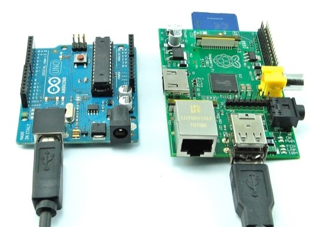
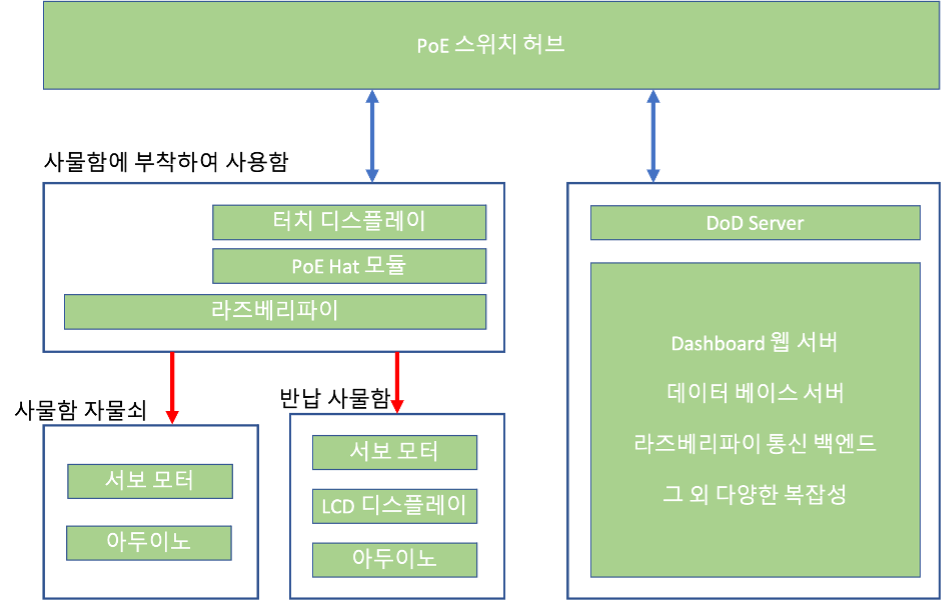
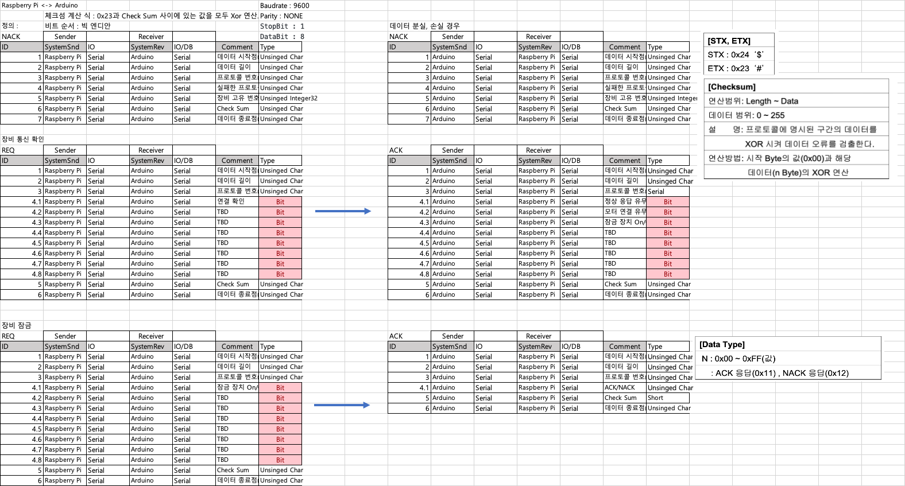

# ERP 시스템에 적용되는 아두이노

## 아두이노로 무엇을 하나요?

자재 관리 사물함, 반품박스 만들어서 도어락 시스템 구현 입니다.

## 아두이노는 누구랑 통신 하나요?

아두이노는 라즈베리파이와 Serial 통신할 예정입니다. TTL 형식으로 통신 하는것이 아닌 USB A to B 형식으로 연결이 될겁니다.
라즈베리파이와 통신하여 아두이노의 상태를 전달하고, 잠금, 해제 합니다.

## 전원 공급은 어떻게 할 것인가요?

전원 공급은 USB A to B를 통해서 전원 공급과 데이터 전송을 함께 할 예정입니다. 그렇게 된다면 선 1개로 모든것이 가능하니, 사물함에 구멍을 내더라도 1개만 내도 됩니다. 

라즈베리파이는 PoE 스위치 허브를 통하여 전원 공급과 ERP 서버와 통신 합니다.

 와! 이것이 전원 공급표!
{: .text-center }

## 통신 프로토콜 설명

 이것이 이미지!
{: .text-center }

자세한 내용은 아래의 링크를 통하여 확인이 가능합니다.

[프로토콜 데이터 소개 및 다운로드](https://github.com/asw-dod/Erp-Document/blob/main/protocol/ERP%20%EC%8B%9C%EC%8A%A4%ED%85%9C%20%ED%91%9C%EC%A4%80%20%ED%86%B5%EC%8B%A0%20%ED%94%84%EB%A1%9C%ED%86%A0%EC%BD%9C%20%EC%A0%95%EC%9D%98_2021_10_28.xlsx?raw=true)
 
[통신 관련된 데이터를 정의한 레포지토리](https://github.com/asw-dod/Erp-Document)

